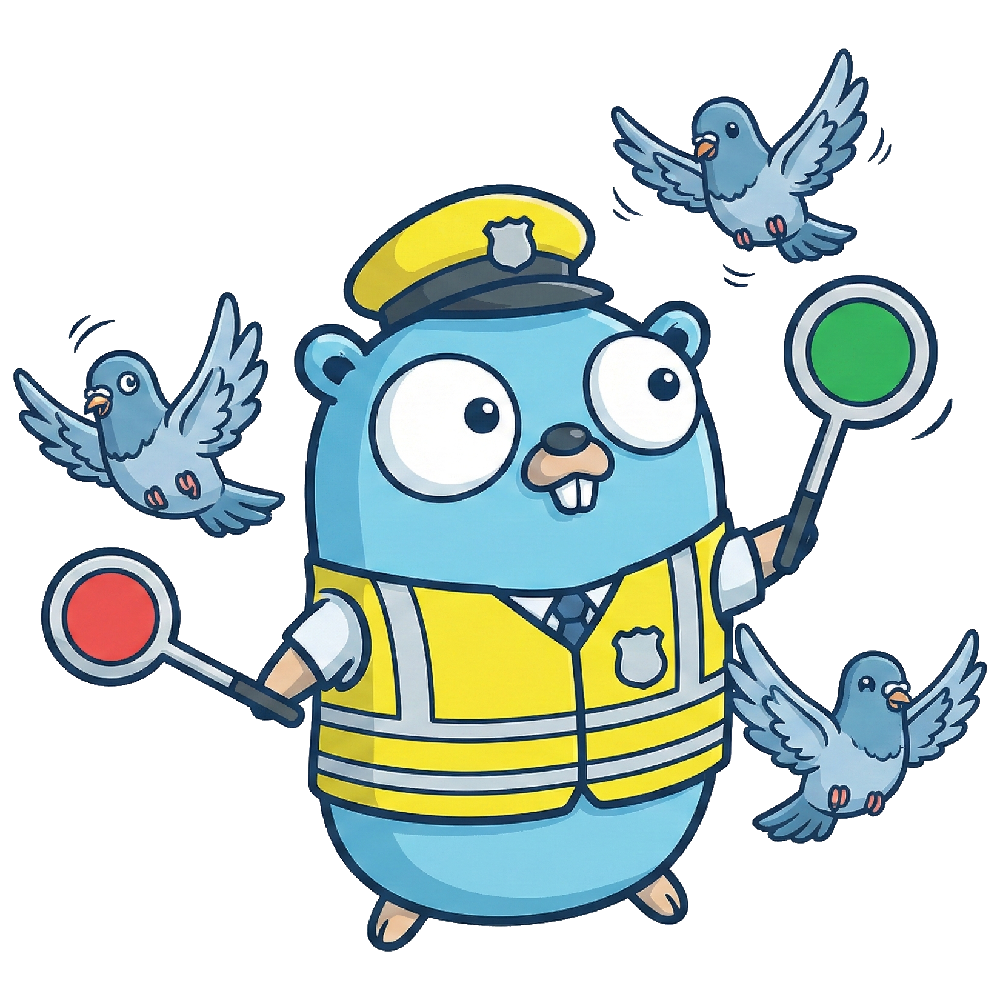

# dovewarden

A Dovecot replication controller, bringing back replication to Dovecot 2.4+ servers.



dovewarden listens for Dovecot events that indicate a changed mailbox, and then runs doveadm sync commands to replicate the changes to another Dovecot server. It does not require any changes to the Dovecot packages.

## Features

- small footprint, easy to deploy Golang application
- relies on standard Dovecot Event API and Doveadm API
- batteries included but swappable queue: in-memory (miniredis) or external Redis for scale-out and high availability
- comprehensive Prometheus metrics for monitoring
- high test coverage and E2E tests with real Dovecot servers

## Configuration

Configuration is possible using either environment variables or CLI flags.

- `DOVEWARDEN_HTTP_ADDR` (`--http-addr`): HTTP server listen address for events (default: `:8080`)
- `DOVEWARDEN_METRICS_ADDR` (`--metrics-addr`): HTTP server listen address for Prometheus metrics (default: `:9090`)
- `DOVEWARDEN_REDIS_MODE` (`--redis-mode`): Redis mode: `inmemory` or `external` (default: `inmemory`)
- `DOVEWARDEN_REDIS_ADDR` (`--redis-addr`): Redis server address for external mode (default: `localhost:6379`)
- `DOVEWARDEN_NAMESPACE` (`--namespace`): Key namespace prefix for queue keys (default: `dovewarden`)
- `DOVEWARDEN_NUM_WORKERS` (`--num-workers`): Number of worker goroutines for dequeuing (default: `4`)
- `DOVEWARDEN_DOVEADM_URL` (`--doveadm-url`): Doveadm API base URL (default: `http://localhost:8080`)
- `DOVEWARDEN_DOVEADM_PASSWORD` (`--doveadm-password`): Doveadm API password (required)
- `DOVEWARDEN_DOVEADM_DEST` (`--doveadm-dest`): Doveadm dsync destination (default: `imap`)
- `DOVEWARDEN_LOG_LEVEL` (`--log-level`): Log level: debug, info, warn, error (default: `info`)
- `DOVEWARDEN_BACKGROUND_REPLICATION_ENABLED` (`--background-replication-enabled`): Enable background replication (default: `true`)
- `DOVEWARDEN_BACKGROUND_REPLICATION_INTERVAL` (`--background-replication-interval`): Background replication interval (default: `1h`)
- `DOVEWARDEN_BACKGROUND_REPLICATION_THRESHOLD` (`--background-replication-threshold`): Skip users replicated within this time (default: `24h`)

### Background Replication

Background replication periodically lists all users from the Doveadm API and enqueues them for replication if they haven't been replicated within the configured threshold. This ensures that users who haven't triggered any IMAP events are still regularly replicated.

The background replication service:
- Runs once immediately on startup
- Then runs periodically based on the configured interval (default: 1 hour)
- Tracks the last replication time for each user in Redis
- Skips users who were replicated within the threshold period (default: 24 hours)
- Can be disabled by setting `DOVEWARDEN_BACKGROUND_REPLICATION_ENABLED=false`

## API Endpoints

- Events server (default `:8080`)
  - POST `/events`
    - `202 Accepted`: Event successfully enqueued
    - `204 No Content`: Event filtered out (not matching criteria)
    - `400 Bad Request`: Malformed JSON or missing required fields
    - `500 Internal Server Error`: Enqueue or queue operation failed

- Metrics server (default `:9090`)
  - GET `/metrics` (Prometheus text format)
  - GET `/healthz` (liveness)
    - Always returns `200 OK` when the process is running
  - GET `/readyz` (readiness)
    - Returns `503 Service Unavailable` until the events listener is bound
    - Returns `503` if the queue backend health check fails
    - Returns `200 OK` when ready and healthy

## Dovecot Configuration

To enable event exporting in Dovecot, add the following configuration to your `dovecot.conf` or a separate included configuration file:

```
# forward sync-related events
event_exporter dovewarden {
  driver = http-post
  http_post_url = http://dovewarden:8080/events

  format = json
  time_format = rfc3339
}

metric dovewarden {
  exporter = dovewarden
  filter = event=imap_command_finished AND tagged_reply_state=OK AND category=service:imap AND ( \
    cmd_name="APPEND" or \
    cmd_name="COPY" or \
    cmd_name="CLOSE" or \
    cmd_name="CREATE" or \
    cmd_name="DELETE" or \
    cmd_name="EXPUNGE" or \
    cmd_name="MOVE" or \
    cmd_name="RENAME" or \
    cmd_name="STORE" or \
    cmd_name="UID COPY" or \
    cmd_name="UID EXPUNGE" or \
    cmd_name="UID MOVE" or \
    cmd_name="UID STORE" \
  )
}
```

If installing using the helm chart, a corresponding ConfigMap is created automatically when enabling the `dovecotEventConfig.enabled` option, which can be mounted and included in your Dovecot configuration.

## Installation using helm

The helm chart is available as OCI package from GitHub container registry.

```bash
helm install dovewarden oci://ghcr.io/dovewarden/dovewarden-chart
```

For configuration options, see [values.yaml](helm/dovewarden/values.yaml).
